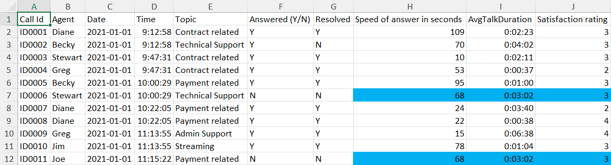
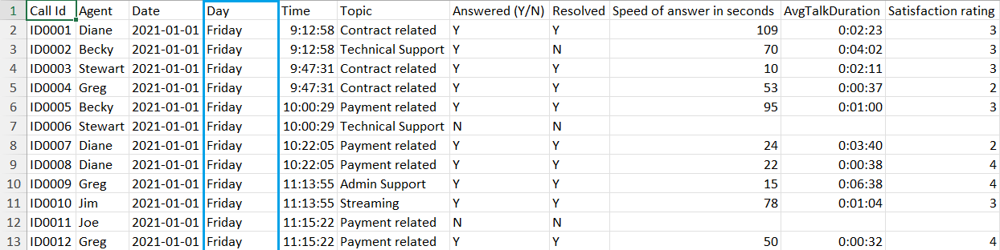

# Call Center KPI Dashboard (PWC Power BI Project Part 1)

## Introduction
This dashboard is Part 1 of a project from the [PwC Power BI micro-internship](https://www.theforage.com/simulations/pwc-ch/power-bi-cqxg) hosted by Forage. Pricewaterhouse Coopers International Limited (PwC) is a multinational professional services brand of firms that specializs in auditing and tax and business consulting.

In this task, I take on the role of a data analyst employed at PwC. PwC's client, a fictional telecom company called PhoneNow, requires a dashboard that visualizes trends in customer and agent behavior. The data used to create this dashboard is PhoneNow's call center data.

## Problem Statement
PhoneNow's call center manager is looking for transparency and insight into the call center data. This includes total number of calls answered and abandoned, spped of answer, and length of calls. The manager is looking for long term trends in customer and agent behavior. The manager will use the resulting dashboard as a basis for discussion with management.

## Skills Demonstrated
* Power BI
* Data Visualization
* Dashboard Creation
* Defining KPIs
* Data Transfroming (Excel)
* Data Transforming (Power BI)

## Data Sourcing
This data was provided to me by the PwC Power BI microinternship hosted by Forage. A copy of the data is included in this repository.

## Data Attributes
The data is from PhoneNow's call center. The data ranges from Jan. 1 2021 to Mar. 31 2021.
* Call Id - A unique ID issued for each call.
* Agent - The call center agent who responded to the call.
* Date - The date the call was made.
* Time - The time the call was made.
* Topic - The topic of the call.
* Answered (Y/N) - Whether the call was answered or abandoned.
* Resolved - Whether the agent was able to resolve the issue of the caller.
* Speed of answer in seconds - The length of time it takes for an agent to answer the call.
* AvgTalkDuration - The average amount of time the agent spent talking to the customer.
* Satisfaction rating - The customer satisfaction rating for a call.

## Data Transformation
The first step when analyzing data and creating a visualization is to look at the data.

We can see that there are missing data in the last 3 columns. The total number of columns missing data are 946, which is 18.92% of the data. Rather than deleting rows with missing data, it is better to replace missing values.

For each column with missing values, find the average value and replace the missing values with the average value.

To add granularity to the data, create a column called "Day", and use the TEXT function to determine the what day the call happened.

Power BI has the ability to convert numeric values into duration (hours:minutes:seconds). Power BI does this by taking the value and multiplying it with the number 86400 (60 seconds * 60 minutes * 24 hours = 86400). We need to convert the "Speed of answer in seconds" column and "AvgTalkDuration" column into numeric values.

First we create a column called "AvgTalkDuration in seconds" and convert the average talk duration into seconds. Then we erase the "AvgTalkDuration" column. Then we create 2 columns called "Speed of answer" and "AvgTalkDuration". For each column, we take the duration in seconds and divide each duration by 86400.

The cleaned data set will look like this.

