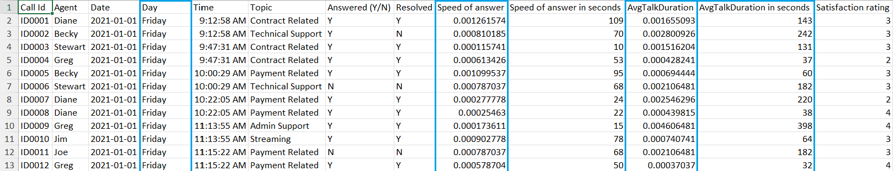
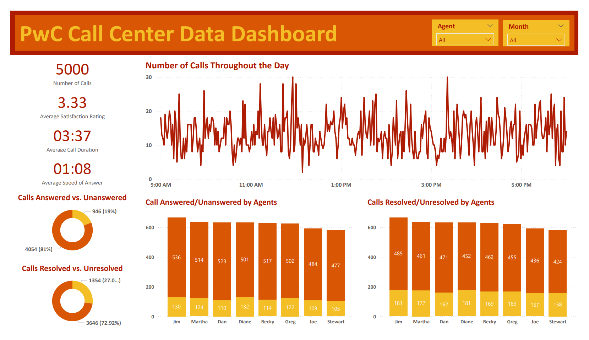

# Call Center KPI Dashboard (PWC Power BI Project Part 1)

## Introduction
This dashboard is Part 1 of a project from the [PwC Power BI micro-internship](https://www.theforage.com/simulations/pwc-ch/power-bi-cqxg) hosted by Forage. Pricewaterhouse Coopers International Limited (PwC) is a multinational professional services brand of firms that specializs in auditing and tax and business consulting.

In this task, I take on the role of a data analyst employed at PwC. PwC's client, a fictional telecom company called PhoneNow, requires a dashboard that visualizes trends in customer and agent behavior. The data used to create this dashboard is PhoneNow's call center data.

## Problem Statement
PhoneNow's call center manager is looking for transparency and insight into the call center data. This includes total number of calls answered and abandoned, speed of answer, and length of calls. The manager is looking for long term trends in customer and agent behavior. The manager will use the resulting dashboard as a basis for discussion with management.

## Skills Demonstrated
* Power BI
* Data Visualization
* Dashboard Creation
* Defining KPIs
* Data Transfroming (Excel)
* Data Transforming (Power BI)
* Creating Measures (Power BI)

## Data Sourcing
This data was provided to me by the PwC Power BI micro-internship hosted by Forage. A copy of the data is included in this repository under the file name: 01 Call-Center-Dataset (Cleaned).xlsx.

## Data Attributes
The data is from PhoneNow's call center. The data ranges from Jan. 1 2021 to Mar. 31 2021.
* Call Id - A unique ID issued for each call.
* Agent - The call center agent who responded to the call.
* Date - The date the call was made.
* Time - The time the call was made.
* Topic - The topic of the call.
* Answered (Y/N) - Whether the call was answered or abandoned.
* Resolved - Whether the agent was able to resolve the issue of the caller.
* Speed of answer in seconds - The length of time it takes for an agent to answer the call.
* AvgTalkDuration - The average amount of time the agent spent talking to the customer.
* Satisfaction rating - The customer satisfaction rating for a call.

## Data Transformation
The data was cleaned and transformed using Excel and the Power Query Editor from Power BI. The steps used to clean and transform the data set are:

In Excel:
* Replace null values in the "Speed of answer in seconds", "AvgTalkDuration", and "Satisfaction rating" columns with average values.
* To add granularity to the data, a "Day" column was created using the TEXT function. The "Day" column shows what day the call hapened.
* Power BI has a data type called duration which can convert numeric values into hours:minutes:seconds. There are two columns wich contain duration data: "Speed of answer in seconds" and "AvgTalkDuration". A new column called "AvgTalkDuration in seconds" was created which converts the values in the "AvgTalkDuration" column into seconds.
* The values in the "Speed of answer in seconds" and "AvgTalkDuration in seconds" columns are converted into numeric values and put into two columns. Seconds are converted into numeric values by dividing the number of seconds by 86400 (60 seconds * 60 minutes * 24 hours).

A screenshot of the cleaned data set is shown below. New columns are outlined in blue.

In Power BI:
* Once the data is loaded into Power BI, the Power Query Editor is needed to transform column data types.
* The "Time" column data type was transformed from Date/Time to Time.
* The "Speed of answer" column data type was transformed from Decimal Number to Duration.
* The "AvgTalkDuration" column data type was transformed from Decimal Number to Duration.
* To calculate the average call duration on Power BI, a measure was created using this formula: AverageCallDuration = FORMAT(AVERAGE('Clean2'[AvgTalkDuration]), "NN:SS")
* To calculate the average speed of answer on Power BI, a measure was created using this formula: AverageAnswerSpeed = Format(AVERAGE('Clean2'[Speed of answer]), "NN:SS")

## Data Analysis and Visuals
A copy of the below dashboard is included in this repository under the file name: James Weber PwC Telecom Dashboard.pbix.

* The average satisfaction rating is 3.33 stars out of 5. Although the average satisfaction is above 2.5 stars, there is still room for growth.
* Approximately a third of the call time is used to answer the question.
* Nearly 20% of calls are unanswered and over 25% of calls are unresolved. The amount of unresolved or unanswered phone calls may contribute to the low average satisfaction rating.
* Approximately 88% of answered calls were resolved (# of calls resolved/# of calls answered). Customers who have their calls answered but unresolved may rate their satisfaction lower than customers whose calls were not answered.
* Agents' all have similar performances. There are no agents who have a much higher or lower percantage of answering or resolving questions compared to other agents. This indicates that there are no outstanding or poorly performing agents.

## Conclusions and Recommendations
* The average customer satisfaction rating of 3.33 stars can be improved to a goal of 4 stars.
* To lower the number of calls unanswered, PhoneNow can hire 1 more agent.
* To lower the number of calls unresolved, agents should be asked about calls and questions they have difficulties answering. A class or weekly email newsletter should include answers and ways to resolved those questions and scenarios .
* Agents could also have references to the most commonly asked questions so that they can answer commonly asked questions as quickly as possible.
