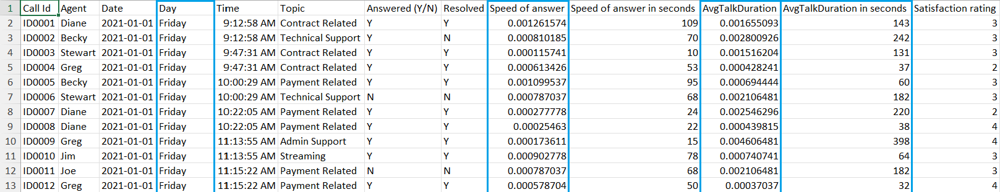
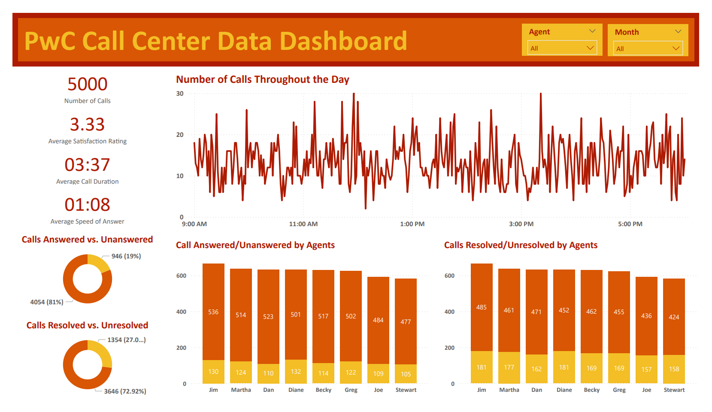

# Call Center KPI Dashboard (PWC Power BI Project Part 1)

## Introduction
This dashboard is Part 1 of a project from the [PwC Power BI micro-internship](https://www.theforage.com/simulations/pwc-ch/power-bi-cqxg) hosted by Forage. Pricewaterhouse Coopers International Limited (PwC) is a multinational professional services brand of firms that specializes in auditing and tax and business consulting.

In this task, I take on the role of a data analyst employed at PwC. PwC's client, a fictional telecom company called PhoneNow, requires a dashboard that visualizes trends in customer and agent behavior. The data used to create this dashboard is PhoneNow's call center data.

## Problem Statement
PhoneNow's call center manager is looking for transparency and insight into the call center data. This includes total number of calls answered and abandoned, speed of answer, and length of calls. The data depicts calls made fron January to March of the same year. The manager is looking for long term trends in customer and agent behavior. The manager will use the resulting dashboard as a basis for discussion with management.

## Skills Demonstrated
* Power BI
* Data Visualization
* Dashboard Creation
* Defining KPIs
* Data Transfroming (Excel)
* Data Transforming (Power BI)
* Creating Measures (Power BI)

## Data Sourcing
This data was provided to me by the PwC Power BI micro-internship hosted by Forage. A copy of the data is included in this repository under the file name: 01 Call-Center-Dataset (Cleaned).xlsx.

## Data Attributes
The data is from PhoneNow's call center. The data ranges from Jan. 1 2021 to Mar. 31 2021.
* Call Id - A unique ID issued for each call.
* Agent - The call center agent who responded to the call.
* Date - The date the call was made.
* Time - The time the call was made.
* Topic - The topic of the call.
* Answered (Y/N) - Whether the call was answered or abandoned.
* Resolved - Whether the agent was able to resolve the issue of the caller.
* Speed of answer in seconds - The length of time it takes for an agent to answer the call.
* AvgTalkDuration - The average amount of time the agent spent talking to the customer.
* Satisfaction rating - The customer satisfaction rating for a call.

## Data Transformation
The data was cleaned and transformed using Excel and the Power Query Editor from Power BI. The steps used to clean and transform the data set are:

In Excel:
* Replace null values in the "Speed of answer in seconds", "AvgTalkDuration", and "Satisfaction rating" columns with average values.
* To add granularity to the data, a "Day" column was created using the TEXT function. The "Day" column shows what day the call hapened.
* Power BI has a data type called duration which can convert numeric values into hours:minutes:seconds. There are two columns wich contain duration data: "Speed of answer in seconds" and "AvgTalkDuration". A new column called "AvgTalkDuration in seconds" was created which converts the values in the "AvgTalkDuration" column into seconds.
* The values in the "Speed of answer in seconds" and "AvgTalkDuration in seconds" columns are converted into numeric values and put into two columns. Seconds are converted into numeric values by dividing the number of seconds by 86400 (60 seconds * 60 minutes * 24 hours).

A screenshot of the cleaned data set is shown below. New columns are outlined in blue.

In Power BI:
* Once the data is loaded into Power BI, the Power Query Editor is needed to transform column data types.
* The "Time" column data type was transformed from Date/Time to Time.
* The "Speed of answer" column data type was transformed from Decimal Number to Duration.
* The "AvgTalkDuration" column data type was transformed from Decimal Number to Duration.
* To calculate the average call duration on Power BI, a measure was created using this formula: AverageCallDuration = FORMAT(AVERAGE('Clean2'[AvgTalkDuration]), "NN:SS")
* To calculate the average speed of answer on Power BI, a measure was created using this formula: AverageAnswerSpeed = Format(AVERAGE('Clean2'[Speed of answer]), "NN:SS")

## Data Analysis and Visuals
A copy of the below dashboard is included in this repository under the file name: James Weber PwC Telecom Dashboard.pbix.

* PhoneNow is facing a low customer satisfaction score of 3.33 out of 5.
* On average, customers are waiting 1 minute and 8 seconds to speak with an agent for a call that only lasts 3 minutes and 37 seconds. The wait-to-tallk ratio of 31%.
* Industry standard 80/20 rule states that 80% of calls should be answered within 20 seconds.
* Approximately 19% of customers hang up (call unanswered) before reaching an agent. The average wait time of 1 minute 8 seconds indicates that many customers lose their patience during the wait time.
* Of the 1354 unresolved calls, 946 calls were unanswered. This means that 408 (8% of total) customers spoke to an agent, but their issue remains unresolved.
* Of the 4054 answered calls, 3646 (90%) were resolved. This, combined with the fact that the average call lasts 3 minutes and 37 seconds indicate that the issue is not the quality of the agents.
* Agent-level data shows that the missed call problem is systemic, rather than being caused by one or two underperformers. In terms of calls answered and calls resolved, the highest and lowest performing agents have little variance in answer and resolution rates.

## Conclusions and Recommendations
* The biggest contributor to PhoneNow's low customer satisfaction rating is due to long wait times, which heavily contributes to the number of calls unanswered. Reducing wait time will not only reduce the number of calls unanswered, it would also reduce the number of unresolved calls due to unasnwered calls.
* The reduce customer wait time, PhoneNow should hire 2 more agents to increase the availabilty of agents to answer calls and help customers.
* With 4054 calls answered and 8 agents, the average number of calls an agent asnwers in 3 months is approximately 507 calls. Assuming that each agent can comfortably answer 507 calls per 3 months, adding 2 more agents will increase the total answered calls to 5070 calls, which is just over the 5000 total calls in this data set.
